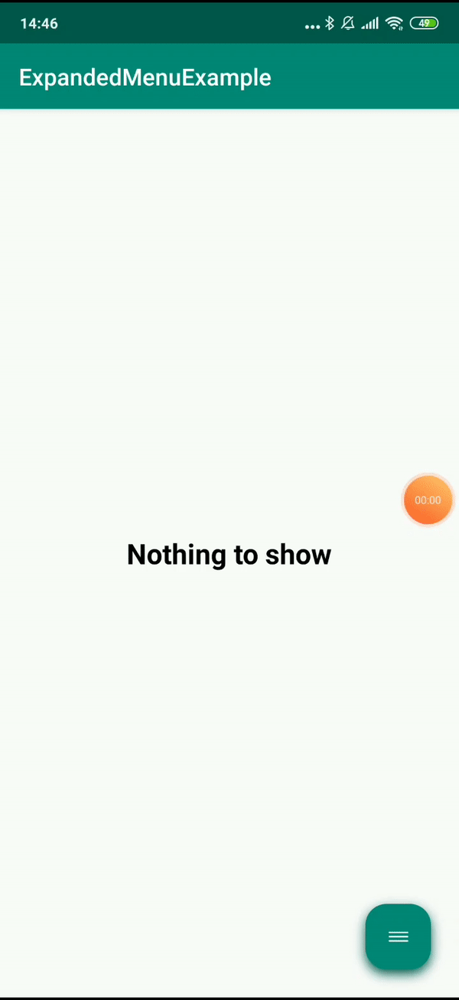

# ExpandedMenuView
Expanded Menu View library

For one application, I had to develop such a menu, so I decided to share it with everyone



### Usage

Reference the library from your module's build.gradle:

``` gradle
dependencies {
    [...]
    implementation 'com.github.luksoral:ExpandedMenuView:[latest_version]'
}
```

Latest version: [](https://jitpack.io/#luksoral/ExpandedMenuView)

Android arsenal: []( https://android-arsenal.com/details/1/7809 )

Add `ExpandedMenuView` as a view to the layout:

``` xml
<pro.midev.expandedmenulibrary.ExpandedMenuView
        android:id="@+id/expMenu"
        android:layout_width="match_parent"
        android:layout_height="match_parent"
        app:em_background_color="@color/colorPrimary"
        app:em_shadow_color="@color/colorPrimaryDark"
        app:em_menu_icon="@drawable/ic_menu"
        app:em_close_menu_icon="@drawable/ic_close_menu"
        app:em_text_color="@android:color/white"
        app:em_outside_margin="24dp"
        app:em_font_family="@font/rubik_medium"
        app:em_is_on_click_closable="true"
        app:em_corner_radius="8dp"/>
```

`em_background_color` - menu background color\
`em_menu_icon` - menu icon drawable\
`em_close_menu_icon` - close menu icon drawable\
`em_shadow_color` - menu shadow color\
`em_text_color` - menu title color\
`em_outside_margin` - menu outside margin\
`em_font_family` - menu title font-family\
`em_is_on_click_closable` - close menu by item click when true\

Add code below for icons and titles initialization (can take 3 or 4 items)

``` xml
<expandableMenuViewId>.setIcons(
            ExpandedMenuItem(R.drawable.ic_home, "Home", ContextCompat.getColor(this, R.color.colorAccent)),
            ExpandedMenuItem(R.drawable.ic_qr, "QR-code", ContextCompat.getColor(this, R.color.colorAccent)),
            ExpandedMenuItem(R.drawable.ic_main_menu, "Menu", ContextCompat.getColor(this, R.color.colorAccent)),
            ExpandedMenuItem(R.drawable.ic_profile, "Profile", ContextCompat.getColor(this, R.color.colorAccent))
        )
```

`ExpandableMenuItem` - data object menu item

Add item click listener
``` xml
expMenu.setOnItemClickListener(this)
```

`ExpandedMenuClickListener` - interface for listen items click
